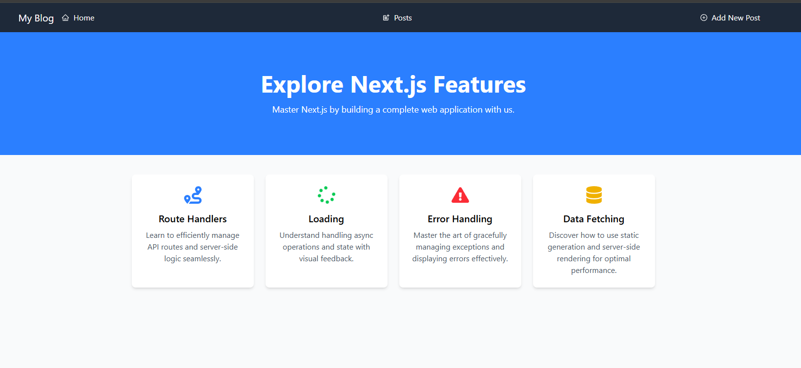
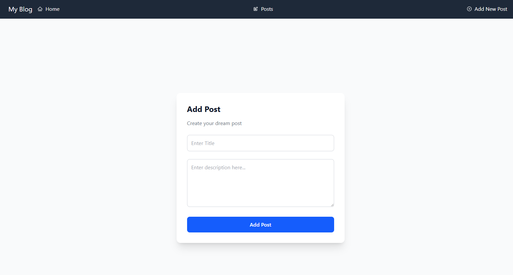

# Fullstack Blog Application

This is a fullstack web application built with **Next.js 16**, **React 19**, and **MongoDB**. It serves as a comprehensive demonstration of modern Next.js features, including the App Router, Server Components, Route Handlers, and robust error/loading states.

## 🚀 Features

- **Full CRUD Operations**: Create, Read, Update, and Delete posts.
- **Next.js App Router**: Utilizes the latest routing paradigm with nested layouts.
- **Route Handlers**: API routes implemented in `app/api/posts` for backend logic.
- **Database Integration**: Connects to MongoDB using **Mongoose** for data modeling.
- **Form Handling**: robust forms built with **Formik** and validation using **Yup**.
- **Styling**: Modern, responsive UI designed with **Tailwind CSS v4**.
- **UX Enhancements**:
  - Custom **Loading** states (`loading.js`)
  - Custom **Error** handling (`error.js`)

## 🛠️ Tech Stack

- **Framework**: [Next.js 16](https://nextjs.org/)
- **Library**: [React 19](https://react.dev/)
- **Database**: [MongoDB](https://www.mongodb.com/)
- **ORM**: [Mongoose](https://mongoosejs.com/)
- **Styling**: [Tailwind CSS](https://tailwindcss.com/)
- **Icons**: [React Icons](https://react-icons.github.io/react-icons/)
- **Forms**: [Formik](https://formik.org/) + [Yup](https://github.com/jquense/yup)

## 📂 Project Structure

- `app/`: Main application source code (App Router structure).
  - `api/`: Backend API routes.
  - `posts/`: Frontend routes for post management (create, edit, view).
- `models/`: Mongoose data models (e.g., `Posts.js`).
- `utils/`: Utility functions, including database connection (`connectDb.js`).
- `components/`: Reusable React components.

## 🏁 Getting Started

Follow these steps to set up and run the project locally.

### Prerequisites

- Node.js installed on your machine.
- A MongoDB database (local or Atlas).

### Installation

1.  **Clone the repository:**

    ```bash
    git clone https://github.com/rvega1204/Nextjs-fullstack-blog-app
    cd fullstack-blog-app
    ```

2.  **Install dependencies:**

    ```bash
    npm install
    ```

3.  **Environment Setup:**

    Create a `.env` file in the root directory and add your MongoDB connection string:

    ```env
    MONGODB_URI=your_mongodb_connection_string
    ```

4.  **Run the development server:**

    ```bash
    npm run dev
    ```

5.  **Open the app:**

    Visit [http://localhost:3000](http://localhost:3000) in your browser.

## 📜 Scripts

- `npm run dev`: Runs the app in development mode.
- `npm run build`: Builds the app for production.
- `npm run start`: Starts the production server.
- `npm run test`: Runs the tests.

## Testing

This project includes a suite of tests to ensure reliability and functionality.

To run the tests, use the following command:

```bash
npm run test
```

The tests cover various aspects of the application, including component rendering, API route handlers, and utility functions.

## 🤝 Contributing

Contributions, issues, and feature requests are welcome!

## 📸 Screenshots

### Home Page



### Create Post Page



## 📝 License

This project is open source and available under the [MIT License](LICENSE).

## 📝 Author

- **[Ricardo Vega](https://github.com/rvega1204)**
